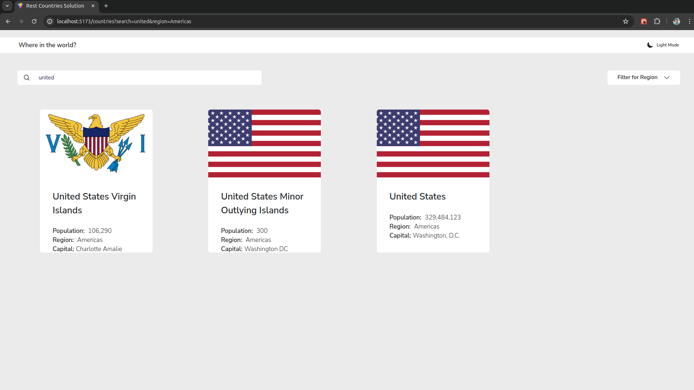
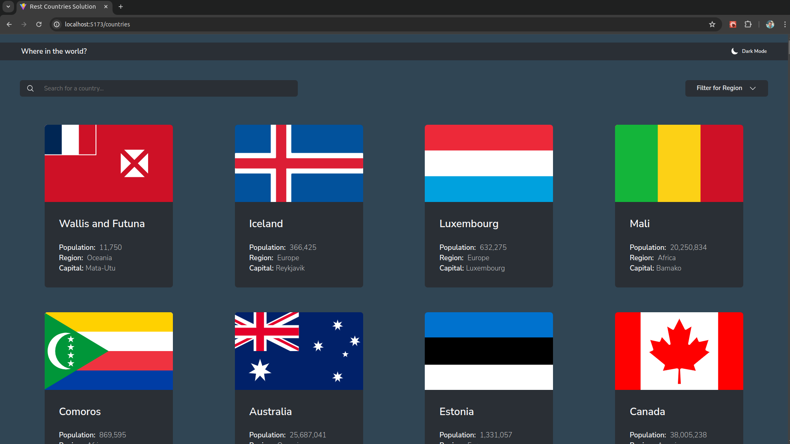
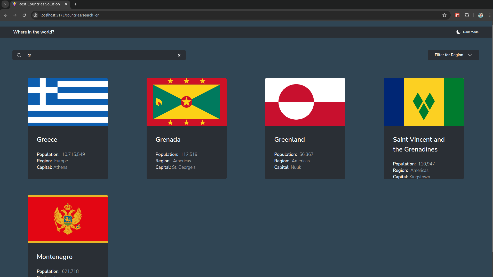
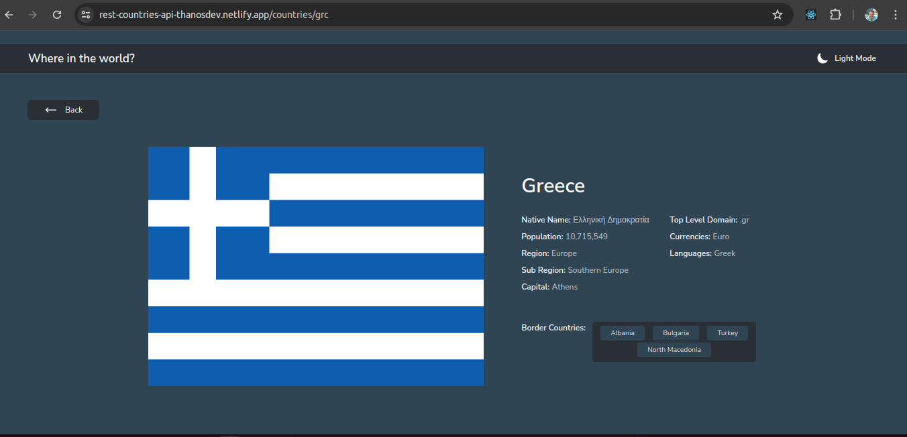
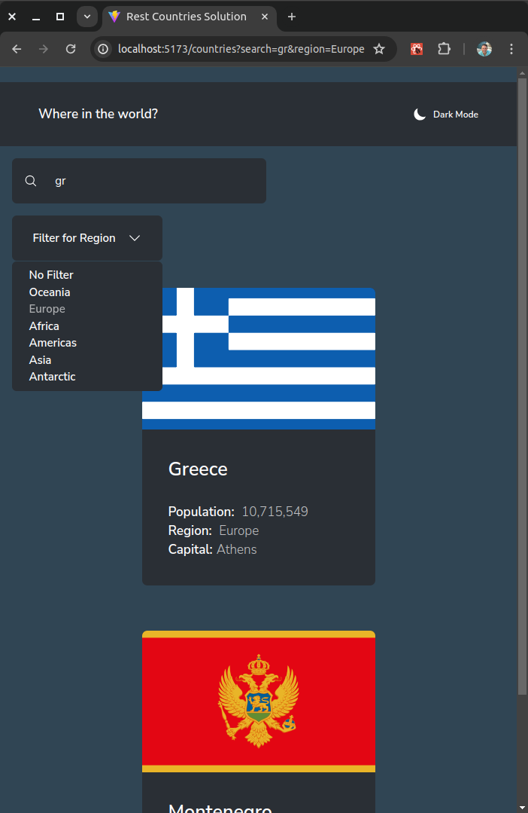
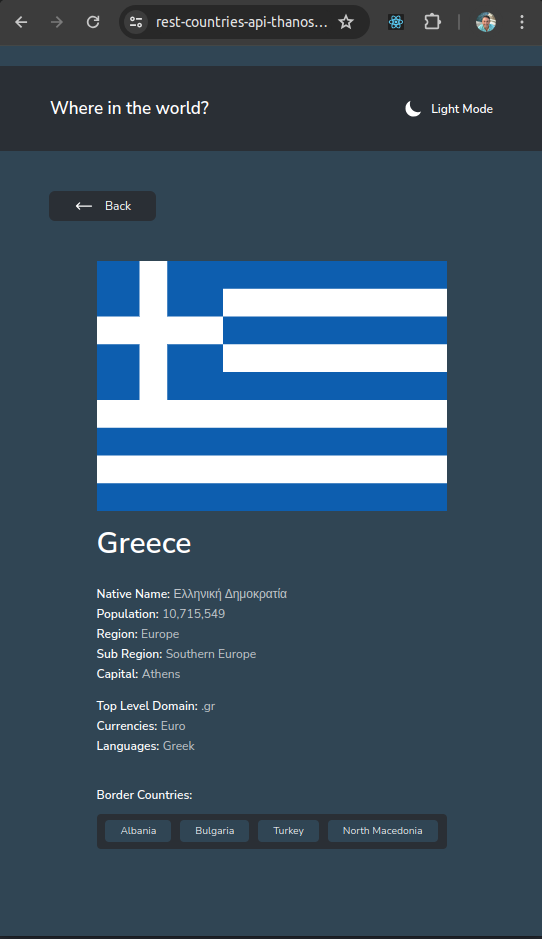

# Frontend Mentor - REST Countries API with color theme switcher solution

This is a solution to the [REST Countries API with color theme switcher challenge on Frontend Mentor](https://www.frontendmentor.io/challenges/rest-countries-api-with-color-theme-switcher-5cacc469fec04111f7b848ca). Frontend Mentor challenges help you improve your coding skills by building realistic projects.

## Table of contents

- [Frontend Mentor - REST Countries API with color theme switcher solution](#frontend-mentor---rest-countries-api-with-color-theme-switcher-solution)
  - [Table of contents](#table-of-contents)
  - [Overview](#overview)
    - [The challenge](#the-challenge)
    - [Screenshots](#screenshots)
    - [Links](#links)
  - [My process](#my-process)
    - [Built with](#built-with)
      - [React](#react)
    - [Component structure:](#component-structure)
    - [Useful resources](#useful-resources)
  - [Author](#author)

## Overview

The application fetches countries data requesting response from [restcountries API](https://restcountries.com) and renders these data on two actual page layouts:

- one layout as a card view with the abilities to search for a country and apply a region filter
- and the other as country details if the user clicks on a country card.

### The challenge

Users should be able to:

- See all countries from the API on the homepage
- Search for a country using an `input` field
- Filter countries by region
- Click on a country to see more detailed information on a separate page
- Click through to the border countries on the detail page
- Toggle the color scheme between light and dark mode _(optional)_

### Screenshots

### Links

- Solution URL: [https://github.com/Thanos-M11/rest-countries](https://github.com/Thanos-M11/rest-countries)
- Live Site URL: [https://rest-countries-api-thanosdev.netlify.app](https://rest-countries-api-thanosdev.netlify.app)

## My process

### Built with

- Semantic HTML5 markup
- Modular CSS using Flex and Grid
- Mobile-first workflow
- svg icons from [heroicons.dev](https://heroicons.dev/)
- [React](https://reactjs.org/) - JS library
  - [createContext](https://react.dev/reference/react/createContext)
  - custom hook useCountries()
  - [useState()](https://react.dev/reference/react/useState)
  - [useEffect()](https://react.dev/reference/react/useEffect)
  - [react router dom](https://reactrouter.com/en/main)
  - [useParams()](https://reactrouter.com/en/main/hooks/use-params)
  - [useSearchParams()](https://reactrouter.com/en/main/hooks/use-search-params)
  - [useNavigate()](https://reactrouter.com/en/main/hooks/use-navigate)

#### React

1. Created a `countriesContext.jsx` file which contains a `countriesContext` a `countriesProvider` and a `useCountries()` custom hook to:

   - manage two main states: `countries` and `isLoading`,
   - manage two derived states: `regions` and `cca3Codes`,
   - fetch countries data from [restcountries API](https://restcountries.com) using `useEffect()` hook
   - provide main state and derived state to the provider's children
   - consume the `countriesContext` in any component that needs access to.

2. `App.jsx`

   - all the components have access to the state from the `CountriesProvider` context.
   - we create a `BrowserRouter` with routes
   - we set as a root component the `Applayout` which contains a `Header` and an `Outlet` component.

### Component structure:

3. We construct our main components as per below:

- `Applayout`: the main app layout
- `Header`: the main header of the app which is stable on any page
- `ModeIcons`: a component with the mode icon (light-dark)
- `NavBar`: it contains a search bar and a drop down menu
- `SearchBar`:
  - uses `useSearchParams()` hook to set a `search` param on the `url`.
  - Contains an `input` element as a controlled element and an `onChange` handler.
- `DropDownMenu`:
  - uses `useCountries` context to import `regions`.
  - uses `searchParams()` hook to set a `region` param.
  - returns o dropdown menu which is displayed on hover with options to filter a region.
  - styled as a relative position to a main container.
- `Outlet`: a react router dom component to render its child route elements. [Documentation](https://reactrouter.com/en/main/components/outlet)
- `CountryList`:
  - uses `useCountries` context to import `countries`, `isLoading`
  - uses `searchParams` to get `search` and `region` params from the `url`
  - sets `filteredCountries` applying both `search` and `region` filters on `countries`
  - renders
    - a `Loader`,
    - a list of:
      - a `Link` to set a `cca3` param on url
      - a `CountryItem` component
- `Loader`: a loader component
- `CountryItem`:
  - destructures the `country` object
  - renders an item with the destructured data.
- `CountryDetails`:
  - uses `useCountries` hook to import `countries` and `cca3Codes`.
  - uses `useParams()` to get from the url the `cca3` param
  - uses `useNavigate()` to navigate programmatically.
  - validates the `cca3` existence.
  - finds the country according to the `cca3` code.
  - destructures the `country` object
  - renders an item with country details
- `PageNotFound`: a page not found component.

### Useful resources

Book: [CSS in Depth by Keith J. Grant](https://www.manning.com/books/css-in-depth-second-edition)

[Josh's Custom CSS Reset](https://www.joshwcomeau.com/css/custom-css-reset/)

## Author

- Website - [Thanos Kalaitzis](https://thanosdev.netlify.app)
- Github - [@Thanos-M11](https://github.com/Thanos-M11)
- LinkedIn - [Thanos Kalaitzis](https://www.linkedin.com/in/thanoskalaitzis/)
- Frontend Mentor - [@Thanos-M11](https://www.frontendmentor.io/profile/Thanos-M11)
